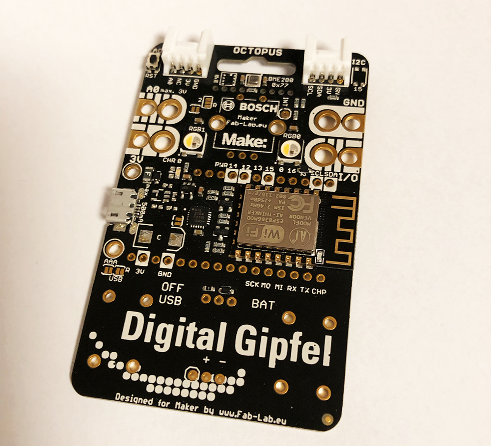

# Programmieren mit dem Octopus

Herzlich Willkommen zur Einführung ins Programmieren mit der Lernplatine "IoT-Octopus".

## Übersicht über die Kapitel

Der Workshop beginnt mit Kapitel 1. Das Kapitel 0 beschreibt die Einrichtung der benötigten Software.

|Kapitel|Inhalt|
|---|---|
|[Kapitel 1](/lesson1/lesson1.md)|Was ist ein Computer?|
|[Kapitel 2](/lesson2/lesson2.md)|Das erste Programm|
|[Kapitel 3](/lesson3/lesson3.md)|Schleifen und Bedingungen|
|[Kapitel 4](/lesson4/lesson4.md)|...|
|[Kapitel 5](/lesson5/lesson5.md)|...|
|[Kapitel 0](/lesson0/lesson0.md)|Einrichtung der Software|

## Weiterführende Links

* Im Kurs kommt die Programmiersprache Microypthon zum Einsatz. [Zur kompletten Dokumentation](https://docs.micropython.org/en/latest/) der Sprache.

* Programmierumgebung ist uPyCraft. Das gibt es [zum kostenlosen Download](https://github.com/DFRobot/uPyCraft).

