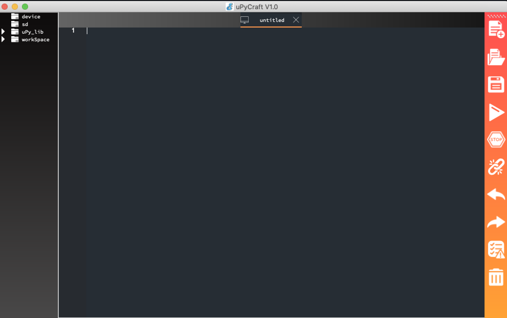

# Kapitel 0: Vorbereitung der benötigten Software

In dieser Programmier-Einführung geht es um die Platine IoT-Octopus. Die könnte man in verschiedenen Programmiersprachen programmieren. Wir haben uns für Python (Micropython) entschieden. Gegenüber C++ ist es vergleichsweise einsteigerfreundlich. Damit Sie alle Beispiele zu Hause nachbauen könnt, hier eine kurze Installationsanleitung.

Sie brauchen einen PC mit Windows, macOS oder Linux. Hier die drei Anleitungen. Am Ende dieser Seite gibt es dann einen Abschnitt für alle Betriebssysteme, um den Octopus vorzubereiten.

## Installieren unter Windows

1. Installieren Sie zunächst Python. Das gibt es [hier zum Herunterladen](https://www.python.org/ftp/python/3.7.2/python-3.7.2-amd64.exe). Klicken Sie sich durch den Installer.
2. Laden Sie uPyCraft herunter. Den [Download gibt es hier](https://raw.githubusercontent.com/DFRobot/uPyCraft/master/uPyCraft.exe).
3. uPyCraft muss man nicht installieren. Starten Sie einfach die Exe-Datei und das Programm ist bereit.

## Installieren unter macOS

1. Installieren Sie zunächst Python. Das geht schnell mit dem Paketverwalter `brew`. Öffnen Sie das Programm `terminal` und geben Sie ein:

2. Laden Sie uPyCraft herunter. Den [Download gibt es hier](https://raw.githubusercontent.com/DFRobot/uPyCraft/master/uPyCraft_mac_V1.0.zip).
3. Entpacken Sie die Zip-Datei und führen Sie die Datei darin aus. MacOS wird sich beschweren, dass das Programm nicht aus dem Store stammt. Öffnen Sie die Systemeinstellungen, dort den Punkt "Sicherheit" und klicken Sie "dennoch öffnen"

## Installieren unter Linux

Sie haben sich für Linux entschieden. Dann wissen Sie sicher am besten, wie Sie Python 3 in Ihrer Distribution installieren. uPyCraft gibt es [hier zum Download](https://git.oschina.net/dfrobot/upycraft/raw/master/uPyCraft_linux_V0.30).

## Einrichten für alle

Schließen Sie jetzt den IoT-Octopus per USB an und öffnen Sie uPyCraft. Klicken Sie ofen im Menü auf "Tools". Wählen Sie unter "Serial" den Anschluss – der Ocptopus wird der letzte in der Liste sein. Klicken Sie dann auf "BurnFirmware". Der Octopus ist vorbereitet und Sie können mit [Kapitel 1](../lesson1/lesson1.md) starten. 
